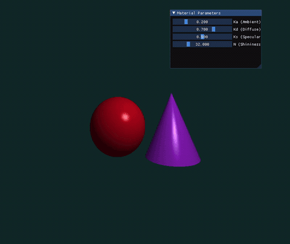
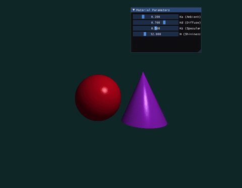
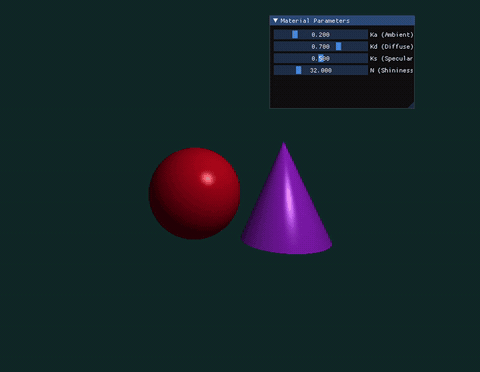
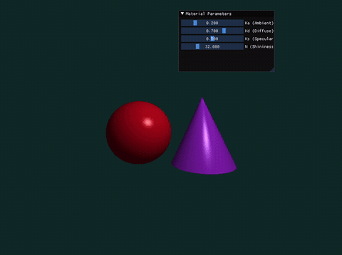
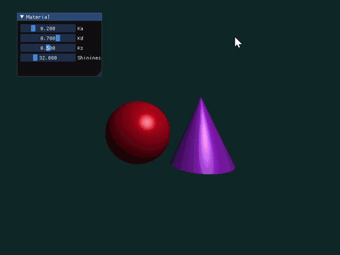

# Taichi Phong 局部光照渲染实验
苏文丽202411081022
## 项目简介
基于 Taichi 实现光线投射(Ray Casting) + Phong 光照交互式渲染，无外部模型，使用隐式方程生成球体、圆锥，UI滑块实时调节光照材质参数。

## 实验目标
1. 理解 Phong 三分量光照：Ambient 环境光 / Diffuse 漫反射 / Specular 镜面高光
2. 掌握三维向量运算、光线求交、Z-Buffer 深度遮挡逻辑
3. 使用 Taichi 完成光线渲染与交互式参数调节

## 光照原理
Phong 总光照公式：
$$I = I_{ambient} + I_{diffuse} + I_{specular}$$
- Ambient：全局均匀背景光
- Diffuse：朗伯漫反射，依赖法向量与光线夹角
- Specular：镜面高光，高光指数控制光斑范围

## 场景配置
- 物体：左侧红色球体、右侧紫色圆锥（隐式几何求交）
- 相机位置：(0, 0, 5)
- 白光点光源：(2, 3, 4)
- 深度测试：实现 Z-Buffer，取最近交点完成遮挡着色

## 可调交互参数
| 参数 | 调节范围 | 默认值 |
|------|----------|--------|
| Ka 环境光系数 | 0.0 ~ 1.0 | 0.2 |
| Kd 漫反射系数 | 0.0 ~ 1.0 | 0.7 |
| Ks 高光系数 | 0.0 ~ 1.0 | 0.5 |
| Shininess 高光指数 | 1.0 ~ 128.0 | 32.0 |

## 环境依赖
- Python 3.8+
- taichi >= 1.4.0

## 渲染演示效果
<p align="center">
  
  <br><br>
  
  <br><br>
  
  <br><br>
  
</p>

## 6. 选做内容
### 6.1 Blinn-Phong 光照模型升级
#### 实现原理
基于标准Phong光照模型进行改造，引入**半程向量 $\mathbf{H}$** 简化高光计算：
半程向量定义为视线向量 $\mathbf{V}$ 与光源向量 $\mathbf{L}$ 的归一化均值：
$$
\mathbf{H} = \frac{\mathbf{L} + \mathbf{V}}{\|\mathbf{L} + \mathbf{V}\|}
$$
使用法向量与半程向量的点积 $\mathbf{N} \cdot \mathbf{H}$ 替代Phong模型中法向量与反射向量的点积 $\mathbf{R} \cdot \mathbf{V}$ 计算高光项，完整光照公式：
$$
I_{\text{Blinn-Phong}} = I_a k_a + I_d k_d (\mathbf{N} \cdot \mathbf{L}) + I_s k_s (\mathbf{N} \cdot \mathbf{H})^n
$$

#### 视觉表现对比
1. **Phong模型**：高光区域随视线偏移衰减速度更快，大入射角下高光范围收缩明显，高光边缘过渡生硬，容易出现高光断裂；反射向量 $\mathbf{R}$ 计算开销更大。
2. **Blinn-Phong模型**：高光区域更宽大柔和，大入射角时高光不会快速消失，高光边缘过渡自然，更贴合真实物体高光观感；仅需计算半程向量，计算效率更高，是实时渲染主流方案。

### 6.2 硬阴影（Hard Shadow）实现
#### 实现原理
采用**阴影射线（Shadow Ray）** 算法实现几何硬阴影：
1. 光线与场景几何体求交，得到着色交点；
2. 从交点向光源位置发射一条阴影射线；
3. 对阴影射线做场景碰撞检测：
   - 若射线在抵达光源前与任意几何体相交：交点被遮挡，处于阴影区域，仅保留环境光 $I_a k_a$；
   - 若射线无遮挡：正常叠加环境光、漫反射光、高光项完整光照。

#### 效果特性
硬阴影边界清晰锐利，无渐变过渡，能直观体现几何体之间的遮挡关系，是基础光线追踪标准阴影实现方案。



安装命令：
```bash
pip install taichi


